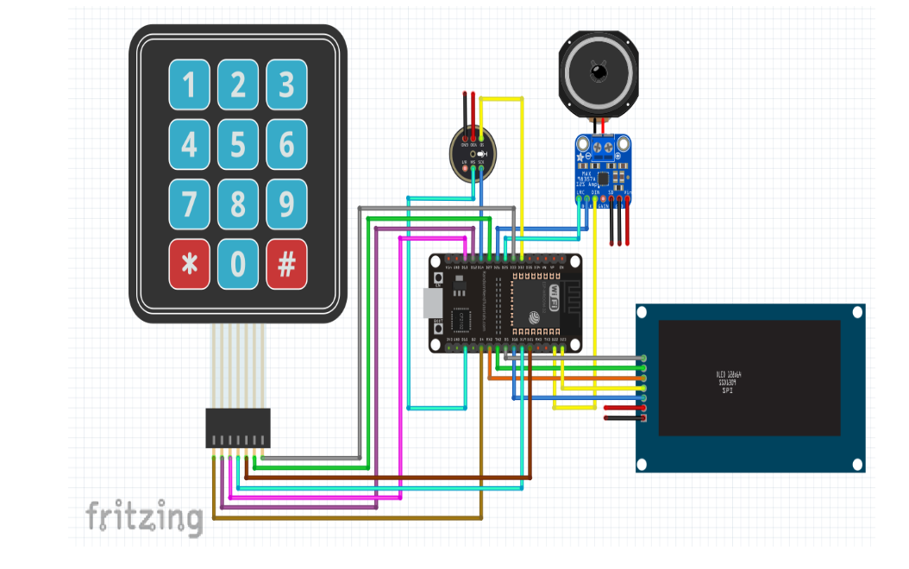
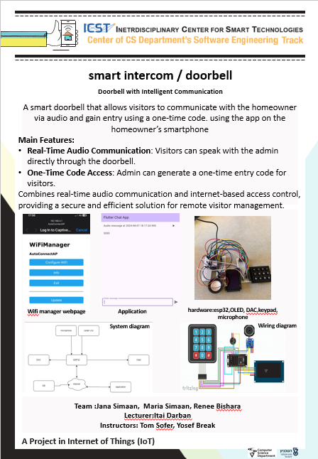

# __Smart Intercom / Doorbell__
## Project by: Renee Bishara, Jana Simaan & Maria Simaan.
In this project we built a smart doorbell that allows visitors to communicate with the homeowner via audio and gain entry using a one-time code. 
The main features of this project are :  
Real-Time Audio Communication - Visitors can send audio message to the admin directly through the doorbell.  
One-Time Code Access - Admin can generate a one-time entry code for visitors.
Combines real-time audio communication and internet-based access control, providing a secure and efficient solution for remote visitor management.

# Folder description :
- UniTests: tests for individual hardware components and with integration.
- ESP: source code for the esp side.
- app :the source code for the application

# Hardware
Hardware Components:
- ESP32
- DAC
- OLED
- mic
- keypad

# __Project Diagram__

# __Poster__

